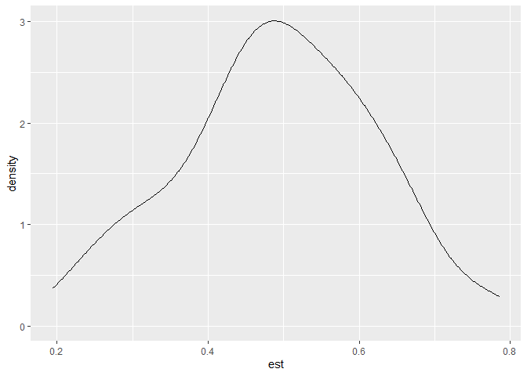
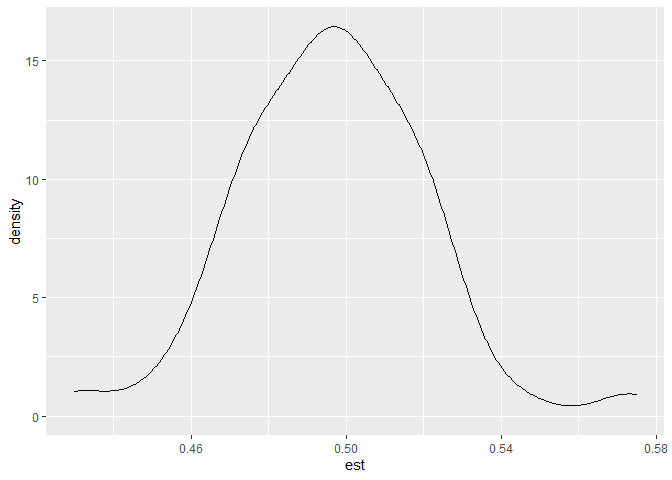

Portfolio4A
================
Yoo Ri Hwang
3/11/2022

## Packages

``` r
library(lme4)
```

    ## Loading required package: Matrix

``` r
library(texreg)
```

    ## Version:  1.37.5
    ## Date:     2020-06-17
    ## Author:   Philip Leifeld (University of Essex)
    ## 
    ## Consider submitting praise using the praise or praise_interactive functions.
    ## Please cite the JSS article in your publications -- see citation("texreg").

## Overview

Connected to Portfolio7 (disregard numeric order) I aim to be familar
with multilevel simulation in this project.

However, I could not understand every function or every concept that
used in here (i.e., kernal density, the list things, and .x…). However,
I tried to get big picture

## Source & Reference

Reference 1:
<https://education.illinois.edu/docs/default-source/carolyn-anderson/edpsy587/lectures/5-estimation/r_markdown_simulate174c1f2f-4e53-45a6-8e56-afb521343a79.html?Status=Master&sfvrsn=6574ad6b_3&download=true/https://education.illinois.edu/docs/default-source/carolyn-anderson/edpsy587/lectures/5-estimation/r_markdown_simulate174c1f2f-4e53-45a6-8e56-afb521343a79.html>

Reference 2:
<https://personality-project.org/r/html/sim.multilevel.html>

Reference 3:
<https://bookdown.org/marklhc/notes/simulating-multilevel-data.html#linear-growth-model>

4: <https://aosmith.rbind.io/2018/04/23/simulate-simulate-part-2/>

5:<https://journals.sagepub.com/doi/full/10.1177/2515245920965119>

6:<https://cran.r-project.org/web/packages/simglm/vignettes/tidy_simulation.html>

# Simulation of Multilevel data

## 1. Random intercept model

We well generate the data as follows:

*L**e**v**e**l*1 : *Y*<sub>*i**j*</sub> = *β*<sub>0*j*</sub> + *β*<sub>1*j*</sub>*x*<sub>*i**j*</sub> + *r*<sub>*i**j*</sub>

*x*<sub>*i**j*</sub> is level-1 predictor

*r*<sub>*i**j*</sub> ∼ *N*(0,*σ*<sup>2</sup>)
Level 2:

*β*<sub>0*j*</sub> = *γ*<sub>00</sub> + *γ*<sub>01</sub>*z*<sub>*j*</sub> + *u*<sub>0*j*</sub>

*β*<sub>1*j*</sub> = *γ*<sub>10</sub>

*z*<sub>*j*</sub> is level-2 predictor (AGE)

*u*<sub>0*j*</sub> ∼ *N*(0,*τ*<sub>0</sub><sup>2</sup>)

Combined together:

*Y*<sub>*i**j*</sub> = *γ*<sub>00</sub> + *γ*<sub>01</sub>*z*<sub>*j*</sub> + *u*<sub>0*j*</sub> + *γ*<sub>10</sub>*x*<sub>*i**j*</sub> + *r*<sub>*i**j*</sub>

### Parameter

Sample size:

I will cet the number of clusters to be 100, and group size to be 20

``` r
# sample size

N<-100 # number of group
nj<- 20 # cluster/group size 

# fixed effect parameter

gamma00<- 5
gamma01<- 2
gamma10<- 3

# set the variance of random coeffiencts

tau2<-2
sigma2<-4
```

### Prepare

``` r
R.intercept<-matrix(,nrow=N*nj,ncol=7) 
head(R.intercept,10)
```

    ##       [,1] [,2] [,3] [,4] [,5] [,6] [,7]
    ##  [1,]   NA   NA   NA   NA   NA   NA   NA
    ##  [2,]   NA   NA   NA   NA   NA   NA   NA
    ##  [3,]   NA   NA   NA   NA   NA   NA   NA
    ##  [4,]   NA   NA   NA   NA   NA   NA   NA
    ##  [5,]   NA   NA   NA   NA   NA   NA   NA
    ##  [6,]   NA   NA   NA   NA   NA   NA   NA
    ##  [7,]   NA   NA   NA   NA   NA   NA   NA
    ##  [8,]   NA   NA   NA   NA   NA   NA   NA
    ##  [9,]   NA   NA   NA   NA   NA   NA   NA
    ## [10,]   NA   NA   NA   NA   NA   NA   NA

``` r
index<-1 # do not understand why doing this. 
```

### Generate data

sampling Macro (e.g., school rather than student)and micro (student
rather than school)

``` r
#outer loop
for(macro in (1:N)){
  u0j=sqrt(tau2)*rnorm(1)
  age=50*runif(1)+20 #age range between 30-70
#iner loop
  for(micro in (1:nj)){
    xij=rnorm(1) #create level-1 predictor 
    z=rnorm(1) # create level-1 residual with sigma2=2
    rij=sqrt(sigma2)*z; 
# DV 
    yij=gamma00+gamma01*xij+gamma01*age+u0j+rij
    R.intercept[index,1:7] <-c(macro,micro,yij,age,xij,u0j,rij)
    index <- index+1 
  }
}

R.intercept<-as.data.frame(R.intercept)
names(R.intercept)<-c("macro","micro","yij","age","xij","u0j","rij")
head(R.intercept,10)
```

    ##    macro micro      yij      age         xij       u0j        rij
    ## 1      1     1 53.74567 23.14484  0.31315643 0.6141184  1.2155586
    ## 2      1     2 51.98010 23.14484  1.06234185 0.6141184 -2.0483907
    ## 3      1     3 52.91381 23.14484 -0.06645829 0.6141184  1.1429281
    ## 4      1     4 52.84034 23.14484  0.35402796 0.6141184  0.2284817
    ## 5      1     5 50.03838 23.14484  0.36044316 0.6141184 -2.5863138
    ## 6      1     6 50.24068 23.14484 -0.49793824 0.6141184 -0.6672500
    ## 7      1     7 52.05018 23.14484  0.56905608 0.6141184 -0.9917390
    ## 8      1     8 47.92341 23.14484 -1.31025303 0.6141184 -1.3598860
    ## 9      1     9 48.06593 23.14484 -0.67030302 0.6141184 -2.4972673
    ## 10     1    10 53.24123 23.14484 -0.61696926 0.6141184  2.5713669

### fitting models

``` r
model1<-lmer(yij~xij+age+(1|macro),data=R.intercept,REML=FALSE)
summary(model1)
```

    ## Linear mixed model fit by maximum likelihood  ['lmerMod']
    ## Formula: yij ~ xij + age + (1 | macro)
    ##    Data: R.intercept
    ## 
    ##      AIC      BIC   logLik deviance df.resid 
    ##   8698.8   8726.8  -4344.4   8688.8     1995 
    ## 
    ## Scaled residuals: 
    ##     Min      1Q  Median      3Q     Max 
    ## -3.3717 -0.6652  0.0164  0.6631  3.2550 
    ## 
    ## Random effects:
    ##  Groups   Name        Variance Std.Dev.
    ##  macro    (Intercept) 1.527    1.236   
    ##  Residual             4.052    2.013   
    ## Number of obs: 2000, groups:  macro, 100
    ## 
    ## Fixed effects:
    ##             Estimate Std. Error t value
    ## (Intercept) 4.563389   0.442810   10.31
    ## xij         2.031193   0.046410   43.77
    ## age         2.010708   0.009866  203.81
    ## 
    ## Correlation of Fixed Effects:
    ##     (Intr) xij   
    ## xij -0.009       
    ## age -0.955  0.006

# Another example:

In the tutorial.. the model equation is not specified.. :(….

it is my guess, but I guess the model is..

*Y*<sub>*i**j*</sub> = *β*<sub>0*j*</sub> + *x*<sub>*i**j*</sub>*β*<sub>1*j*</sub> + *e*<sub>*i**j*</sub>
*β*<sub>0*j*</sub> = *γ*<sub>0</sub> + *u*<sub>0*j*</sub>

*β*<sub>1*j*</sub> = *γ*<sub>1</sub> + *u*<sub>1*j*</sub>
*e*<sub>*i**j*</sub> ∼ *N*(0,*σ*<sup>2</sup>)

$$\\left\[\\begin{matrix}u\_{0j}\\\\u\_{1j}\\\\\\end{matrix}\\right\]\\sim MVN\\left(\\left\[\\begin{matrix}0\\\\0\\\\\\end{matrix}\\right\],\\left\[\\begin{matrix}\\tau\_{00}&\\tau\_{01}\\\\\\tau\_{10}&\\tau\_{11}\\\\\\end{matrix}\\right\]\\right)$$

## packages

``` r
library(tidyverse)
```

    ## -- Attaching packages --------------------------------------- tidyverse 1.3.1 --

    ## v ggplot2 3.3.5     v purrr   0.3.4
    ## v tibble  3.1.4     v dplyr   1.0.8
    ## v tidyr   1.2.0     v stringr 1.4.0
    ## v readr   2.0.1     v forcats 0.5.1

    ## Warning: package 'tidyr' was built under R version 4.1.3

    ## Warning: package 'dplyr' was built under R version 4.1.3

    ## -- Conflicts ------------------------------------------ tidyverse_conflicts() --
    ## x tidyr::expand()  masks Matrix::expand()
    ## x tidyr::extract() masks texreg::extract()
    ## x dplyr::filter()  masks stats::filter()
    ## x dplyr::lag()     masks stats::lag()
    ## x tidyr::pack()    masks Matrix::pack()
    ## x tidyr::unpack()  masks Matrix::unpack()

``` r
library(mnormt)
library(lme4)
```

## Prepare

``` r
set.seed(2208)

#sample size
cn <-20 # cluster number
cs <-4 # cluster size

#fixed effect 

gam <-c(0,0.5) # fix-effect, gamma 0 and gamma1 

#random effect 

G<-matrix(c(0.25,0,
            0, 0.125), nrow=2) # tau00, tau01, tau10, tau11

sigma2 <-1 # within-person variance (1 level, sigma^2)
```

## predictor matrix

``` r
seq_len(cs)
```

    ## [1] 1 2 3 4

``` r
xp<-cbind(1,seq_len(cs) -1) # why -1?
x <- xp[rep(seq_len(cs), cn), ]
```

## ID variable

``` r
cn_id<-seq_len(cn)
pid<-rep(cn_id, each=cs)

print(pid)
```

    ##  [1]  1  1  1  1  2  2  2  2  3  3  3  3  4  4  4  4  5  5  5  5  6  6  6  6  7
    ## [26]  7  7  7  8  8  8  8  9  9  9  9 10 10 10 10 11 11 11 11 12 12 12 12 13 13
    ## [51] 13 13 14 14 14 14 15 15 15 15 16 16 16 16 17 17 17 17 18 18 18 18 19 19 19
    ## [76] 19 20 20 20 20

## random componets

``` r
uj<-rmnorm(cn,mean=rep(0,2), varcov=G)
eij<-rnorm(cn*cs,sd=sqrt(sigma2))
```

## compute Betas, DV, and generate dataframe.

``` r
## compute beta
betaj<-matrix(gam,nrow=cn,ncol=2,byrow=T)+uj


## Compute DV
y<-rowSums(x*betaj[pid,])+eij


## combine that into dataframe
sim_dat1<-tibble(y,time = x[,2],pid)
```

## make function!

``` r
gen_data_sim <- function( cn, cs, gam, G, sigma2=1){

  xp<-cbind(1,seq_len(cs) -1) # why -1?
  x <- xp[rep(seq_len(cs), cn), ]
# id generation
  cn_id<-seq_len(cn)
  pid<-rep(cn_id, each=cs)
  
# random componets 
  uj<-rmnorm(cn,mean=rep(0,2), varcov=G)
  eij<-rnorm(cn*cs,sd=sqrt(sigma2))

## compute beta
  betaj<-matrix(gam,nrow=cn,ncol=2,byrow=T)+uj

## Compute DV
  y<-rowSums(x*betaj[pid,])+eij

## combine that into dataframe
  sim_dat1<-tibble(y,time = x[,2],pid)

## return data
  return(sim_dat1)
}
```

## using function

``` r
gam <-c(0,0.5) 

G<-matrix(c(0.25,0,
            0, 0.01), nrow=2) # tau00, tau01, tau10, tau11

sigma2 <-1 # within-person variance (1 level, sigma^2)

sim_data2<-gen_data_sim(20,4,gam,G)
sim_big_sample<-gen_data_sim(200,50,gam,G) # generting sample that has larger samples 
```

## run the anaysis

``` r
run<-function(df){
  lmer(y~time + (1|pid), data=df)
}
```

``` r
run(sim_dat1)
```

    ## Linear mixed model fit by REML ['lmerMod']
    ## Formula: y ~ time + (1 | pid)
    ##    Data: df
    ## REML criterion at convergence: 255.329
    ## Random effects:
    ##  Groups   Name        Std.Dev.
    ##  pid      (Intercept) 0.7554  
    ##  Residual             1.0187  
    ## Number of obs: 80, groups:  pid, 20
    ## Fixed Effects:
    ## (Intercept)         time  
    ##     0.01368      0.46195

``` r
run(sim_data2)
```

    ## Linear mixed model fit by REML ['lmerMod']
    ## Formula: y ~ time + (1 | pid)
    ##    Data: df
    ## REML criterion at convergence: 236.2337
    ## Random effects:
    ##  Groups   Name        Std.Dev.
    ##  pid      (Intercept) 0.6968  
    ##  Residual             0.8937  
    ## Number of obs: 80, groups:  pid, 20
    ## Fixed Effects:
    ## (Intercept)         time  
    ##      0.1598       0.3392

``` r
run(sim_big_sample)
```

    ## Linear mixed model fit by REML ['lmerMod']
    ## Formula: y ~ time + (1 | pid)
    ##    Data: df
    ## REML criterion at convergence: 40423.59
    ## Random effects:
    ##  Groups   Name        Std.Dev.
    ##  pid      (Intercept) 2.398   
    ##  Residual             1.744   
    ## Number of obs: 10000, groups:  pid, 200
    ## Fixed Effects:
    ## (Intercept)         time  
    ##    -0.04115      0.49401

### run the simulation

``` r
set.seed(2208)

Nrep<-100 # number of replication 

cn <-20 # cluster number
cs <-4 # cluster size

#fixed effect 

gam <-c(0,0.5) # fix-effect, gamma 0 and gamma1 

#random effect 

G<-matrix(c(0.25,0,
            0, 0.125), nrow=2) # tau00, tau01, tau10, tau11

sim_result<-vector("list", length=Nrep)
```

#### For loop

``` r
for (i in seq_len(Nrep)){
  sim_dat <- gen_data_sim(cn,cs,gam,G)
  sim_result[[i]] <- run(sim_dat)
}


#check

sim_result[[Nrep]]
```

    ## Linear mixed model fit by REML ['lmerMod']
    ## Formula: y ~ time + (1 | pid)
    ##    Data: df
    ## REML criterion at convergence: 264.3811
    ## Random effects:
    ##  Groups   Name        Std.Dev.
    ##  pid      (Intercept) 0.6601  
    ##  Residual             1.1184  
    ## Number of obs: 80, groups:  pid, 20
    ## Fixed Effects:
    ## (Intercept)         time  
    ##     -0.2072       0.6748

### extract target statistics

``` r
# extract fixed effect

fixef(sim_result[[1]])
```

    ## (Intercept)        time 
    ##  0.01367995  0.46194936

``` r
# standared error

sqrt(diag(vcov(sim_result[[1]])))
```

    ## [1] 0.2546643 0.1018698

``` r
# confidence interval

confint(sim_result[[1]], parm="time")
```

    ## Computing profile confidence intervals ...

    ##          2.5 %    97.5 %
    ## time 0.2607471 0.6631516

``` r
  fixefs_time <- map(sim_result, 
                   ~ tibble(est = fixef(.x)[2], 
                            se = sqrt(diag(vcov(.x))[2]), 
                            ci = confint(.x, parm = "time")) %>% 
                transmute(est, se, li = ci[1], ui = ci[2])) %>% 
                bind_rows()
```

### summarize the results

``` r
## YR did not learn bias yet 

#bias

summarize(fixefs_time,
          ave_est=mean(est),
          ave_se = mean(se),
          sd_est = sd(est),
          ci_coverage = mean (li <=gam[2] & ui >= gam[2])) %>%
  
  #compuate bias and SE bias 
 mutate(bias = ave_est - gam[2],
        rbias= bias/gam[2],
        se_bias = ave_se-sd_est,
        rse_bias =se_bias/sd_est,
        rmse=bias^2 + sd_est^2)
```

    ## # A tibble: 1 x 9
    ##   ave_est ave_se sd_est ci_coverage     bias   rbias se_bias rse_bias   rmse
    ##     <dbl>  <dbl>  <dbl>       <dbl>    <dbl>   <dbl>   <dbl>    <dbl>  <dbl>
    ## 1   0.492  0.110  0.129        0.86 -0.00826 -0.0165 -0.0191   -0.149 0.0166

## exercise

sample size effects on fixed effect in this model (not in the tutorial )
20x4 sample size (80)

``` r
fixefs_time%>%
  ggplot(aes(x=est))+
  geom_density()
```

<!-- --> 200x50 sample
size

``` r
for (i in seq_len(Nrep)){
  sim_big_sample<-gen_data_sim(200,50,gam,G) 
  sim_result[[i]] <- run(sim_big_sample)
}


# extract fixed effect

fixef(sim_result[[1]])
```

    ## (Intercept)        time 
    ## 0.006753668 0.506845201

``` r
# standared error

sqrt(diag(vcov(sim_result[[1]])))
```

    ## [1] 0.62466806 0.00366569

``` r
# confidence interval

confint(sim_result[[1]], parm="time")
```

    ## Computing profile confidence intervals ...

    ##          2.5 %    97.5 %
    ## time 0.4996602 0.5140302

``` r
  fixefs_time <- map(sim_result, 
                   ~ tibble(est = fixef(.x)[2], 
                            se = sqrt(diag(vcov(.x))[2]), 
                            ci = confint(.x, parm = "time")) %>% 
                transmute(est, se, li = ci[1], ui = ci[2])) %>% 
                bind_rows()
```

    ## Computing profile confidence intervals ...
    ## Computing profile confidence intervals ...
    ## Computing profile confidence intervals ...
    ## Computing profile confidence intervals ...
    ## Computing profile confidence intervals ...
    ## Computing profile confidence intervals ...
    ## Computing profile confidence intervals ...
    ## Computing profile confidence intervals ...
    ## Computing profile confidence intervals ...
    ## Computing profile confidence intervals ...
    ## Computing profile confidence intervals ...
    ## Computing profile confidence intervals ...
    ## Computing profile confidence intervals ...
    ## Computing profile confidence intervals ...
    ## Computing profile confidence intervals ...
    ## Computing profile confidence intervals ...
    ## Computing profile confidence intervals ...
    ## Computing profile confidence intervals ...
    ## Computing profile confidence intervals ...
    ## Computing profile confidence intervals ...
    ## Computing profile confidence intervals ...
    ## Computing profile confidence intervals ...
    ## Computing profile confidence intervals ...
    ## Computing profile confidence intervals ...
    ## Computing profile confidence intervals ...
    ## Computing profile confidence intervals ...
    ## Computing profile confidence intervals ...
    ## Computing profile confidence intervals ...
    ## Computing profile confidence intervals ...
    ## Computing profile confidence intervals ...
    ## Computing profile confidence intervals ...
    ## Computing profile confidence intervals ...
    ## Computing profile confidence intervals ...
    ## Computing profile confidence intervals ...
    ## Computing profile confidence intervals ...
    ## Computing profile confidence intervals ...
    ## Computing profile confidence intervals ...
    ## Computing profile confidence intervals ...
    ## Computing profile confidence intervals ...
    ## Computing profile confidence intervals ...
    ## Computing profile confidence intervals ...
    ## Computing profile confidence intervals ...
    ## Computing profile confidence intervals ...
    ## Computing profile confidence intervals ...
    ## Computing profile confidence intervals ...
    ## Computing profile confidence intervals ...
    ## Computing profile confidence intervals ...
    ## Computing profile confidence intervals ...
    ## Computing profile confidence intervals ...
    ## Computing profile confidence intervals ...
    ## Computing profile confidence intervals ...
    ## Computing profile confidence intervals ...
    ## Computing profile confidence intervals ...
    ## Computing profile confidence intervals ...
    ## Computing profile confidence intervals ...
    ## Computing profile confidence intervals ...
    ## Computing profile confidence intervals ...
    ## Computing profile confidence intervals ...
    ## Computing profile confidence intervals ...
    ## Computing profile confidence intervals ...
    ## Computing profile confidence intervals ...
    ## Computing profile confidence intervals ...
    ## Computing profile confidence intervals ...
    ## Computing profile confidence intervals ...
    ## Computing profile confidence intervals ...
    ## Computing profile confidence intervals ...
    ## Computing profile confidence intervals ...
    ## Computing profile confidence intervals ...
    ## Computing profile confidence intervals ...
    ## Computing profile confidence intervals ...
    ## Computing profile confidence intervals ...
    ## Computing profile confidence intervals ...
    ## Computing profile confidence intervals ...
    ## Computing profile confidence intervals ...
    ## Computing profile confidence intervals ...
    ## Computing profile confidence intervals ...
    ## Computing profile confidence intervals ...
    ## Computing profile confidence intervals ...
    ## Computing profile confidence intervals ...
    ## Computing profile confidence intervals ...
    ## Computing profile confidence intervals ...
    ## Computing profile confidence intervals ...
    ## Computing profile confidence intervals ...
    ## Computing profile confidence intervals ...
    ## Computing profile confidence intervals ...
    ## Computing profile confidence intervals ...
    ## Computing profile confidence intervals ...
    ## Computing profile confidence intervals ...
    ## Computing profile confidence intervals ...
    ## Computing profile confidence intervals ...
    ## Computing profile confidence intervals ...
    ## Computing profile confidence intervals ...
    ## Computing profile confidence intervals ...
    ## Computing profile confidence intervals ...
    ## Computing profile confidence intervals ...
    ## Computing profile confidence intervals ...
    ## Computing profile confidence intervals ...
    ## Computing profile confidence intervals ...
    ## Computing profile confidence intervals ...
    ## Computing profile confidence intervals ...

``` r
summarize(fixefs_time,
          ave_est=mean(est),
          ave_se = mean(se),
          sd_est = sd(est),
          ci_coverage = mean (li <=gam[2] & ui >= gam[2])) %>%
  
  #compuate bias and SE bias 
 mutate(bias = ave_est - gam[2],
        rbias= bias/gam[2],
        se_bias = ave_se-sd_est,
        rse_bias =se_bias/sd_est,
        rmse=bias^2 + sd_est^2)
```

    ## # A tibble: 1 x 9
    ##   ave_est  ave_se sd_est ci_coverage     bias    rbias se_bias rse_bias     rmse
    ##     <dbl>   <dbl>  <dbl>       <dbl>    <dbl>    <dbl>   <dbl>    <dbl>    <dbl>
    ## 1   0.496 0.00362 0.0245        0.25 -0.00363 -0.00726 -0.0209   -0.852 0.000616

``` r
fixefs_time%>%
  ggplot(aes(x=est))+
  geom_density()
```

<!-- -->

As this simulation graph shows, big sample size make graph more
normal-like shape.
